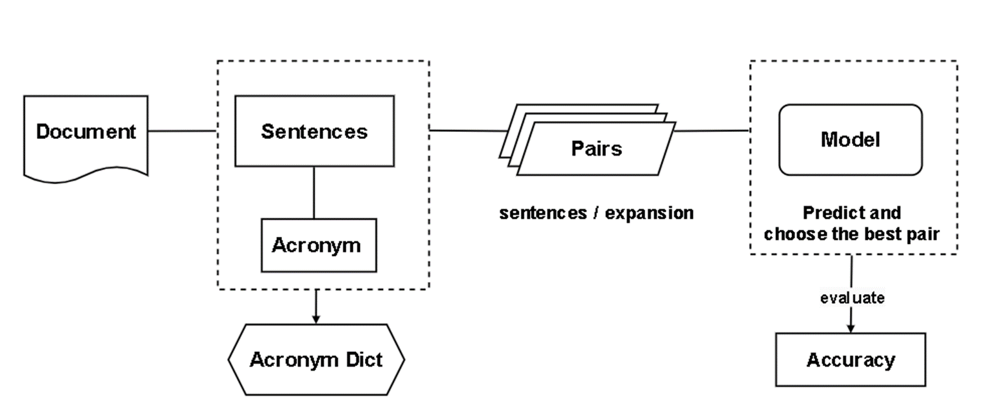

# AcronymExpander
This repo is an implementation of the `Acronym Disambiguation` task. We use the concept of sentence classification tasks to solve it. 

## Workflow

+ First, the abbreviations of each sentence are matched with possible expansions and marked with True/False tags.

+ Then, use DistilBERT to train a sentence classification model to obtain the probability that the abbreviation in the sentence corresponds to each expansion.

+ The one with the highest probability is the expansion produced.

The best model in the experiment can be downloaded [here](https://huggingface.co/fuhsiao/AD-checkpoint-2840)

## References
+ Use `dev.json` and `diction.json` provided by [AAAI-21-SDU-shared-task-2-AD](https://github.com/amirveyseh/AAAI-21-SDU-shared-task-2-AD)
